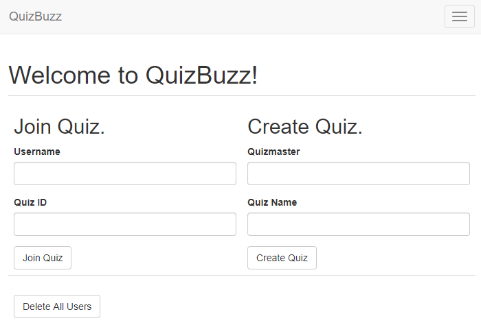
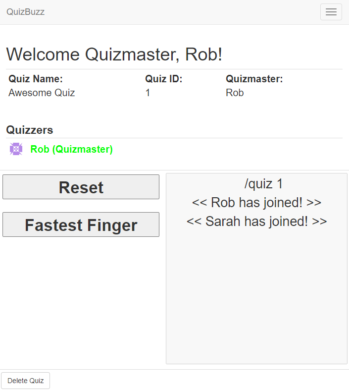
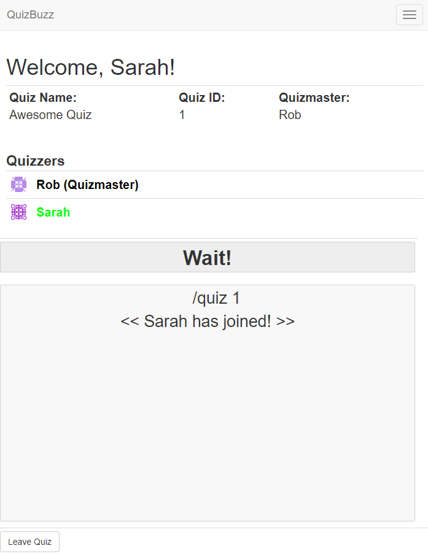

# QuizBuzz - Buzz in Across Devices!

A WebApp built in Python-3.6 with Flask and SocketIO utilizing WebSockets for instant buzzer notifications.

## Installation

It is recommended to create a new python virtual environment and install the dependencies using:

`pip install requirements.txt`

## Configuration

It is possible to receive email alerts when an error occurs. Create a file called `.env` in the root directory of `quizbuzz`. It should contain the following lines:

```
MAIL_SERVER=smtp.googlemail.com
MAIL_PORT=587
MAIL_USE_TLS=1
MAIL_USERNAME=<your username>
MAIL_PASSWORD=<your application specific password from gmail>
MAIL_ADMINS='<your email address>'
```

## Usage

The WebApp can be launched on a `localhost` server by running:

`python ./quizbuzz.py`.

It is launched on port `5000`. To view the interface, visit `http://localhost:5000`. Other users on the same network can visit the interface by visiting `<your local ip>:5000`, _e.g._ `192.168.X.X:5000`.

It may be necessary to add an 'incoming' rule to the firewall of the host machine that allows TCP connections on port `5000`.

## Screenshots

<br>
<br>

